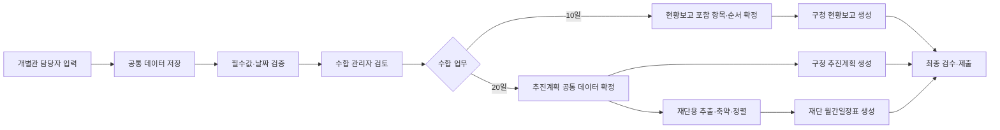

# 문화프로그램 통합수합업무 자동화

- 상태: 진행중
- 목표일: 2026-08-01
- 최초 운영: 2026-08-10 수합
- 노션 원문: [문화프로그램_통합수합업무 자동화](https://app.notion.com/p/3a891b75d56c808cb19cd751b015aa7b)

## 1. 목표

매월 10일과 20일에 개별관이 HWP 파일로 제출하던 문화프로그램 자료를 하나의 웹 시스템에서 표준화하여 입력한다. 수합 관리자는 관별 제출 현황과 오류를 확인하고, 외부기관별 기존 양식에 맞는 결과물을 생성한다.

10일·20일 수합은 별도 업무 프로세스지만 입력, 저장, 검증, 검토, 정렬, 출력이라는 공통 구조를 공유하므로 같은 플랫폼에서 동시에 개발한다.

## 2. 개발 대상

| 구분 | 입력 자료 | 최종 결과 | 제출처 |
|---|---|---|---|
| 매월 10일 | 주요 업무 현황 보고 | 통합 주요 업무 현황 보고 | 구청 |
| 매월 20일 | 주요 업무 추진 계획 | 주요 업무 추진 계획 | 구청 |
| 매월 20일 | 동일 추진계획 원천 데이터 | 월간일정표 | 재단 |

## 3. 공통 개발 범위

- 사용자 인증과 관별 권한
- 수합 업무 구분, 대상 월, 회차와 마감 관리
- 관별 복수 사업·행사 등록
- 단일·기간·반복·복수 회차 일정 표준화
- 임시저장, 제출, 수정 요청, 재제출
- 날짜·요일·기간·필수값·중복 후보 검증
- 사진은 Google Drive로 별도 수령하고 시스템은 텍스트 데이터만 수합
- 관별 제출·미제출·오류 현황
- 관리자 검토, 포함·제외, 출력 순서, 메모
- 문서별 HWPX 템플릿과 독립적인 출력 작업
- 감사 로그와 오류 기록

## 4. 통합 업무 흐름

## 5. 추진 일정

| 일정 | 추진 내용 |
|---|---|
| 2026-07-25~07-31 | 공통 데이터 구조, 제출 화면, 관리자 기능, 검증, 10일·20일 출력 모듈 개발 |
| 2026-08-01 오전 | 내부 담당자 기능 테스트와 오류 수정 |
| 2026-08-01 테스트 완료 후 | 개별관 수합 담당자에게 신규 제출 방식과 링크 안내 |
| 2026-08-01~08-09 | 10일 수합 실제 입력, 문의 대응, 누락·오류 점검 |
| 2026-08-10 | 주요 업무 현황 보고 신규 방식 첫 정식 수합 |
| 2026-08-11~08-19 | 운영 결과 반영과 20일 출력 매핑 최종 검증 |
| 2026-08-20 | 추진계획 수합 및 구청·재단 결과 생성 검증 |

도서관은 8월 1일에도 정상 운영하므로 테스트 완료 당일 안내를 전제로 한다.

## 6. 완료 기준

- 같은 시스템에서 10일·20일 수합 회차를 구분해 관리한다.
- 개별관 담당자가 사업·행사를 등록·수정·제출·재제출할 수 있다.
- 필수값, 날짜·요일, 기간 오류가 제출 전에 검증된다.
- 관리자가 관별 제출 상태, 포함 여부, 출력 순서를 관리한다.
- 10일 구청 현황보고와 20일 구청 추진계획·재단 월간일정표를 각각 생성한다.
- 줄바꿈, 특수문자, 날짜 원문, 기간, 복수 회차 정보가 출력에서 손상되지 않는다.
- 제출자와 관리자가 제출 완료 여부를 명확히 확인한다.

## 7. 1차 운영 원칙

- 외부기관의 기존 HWP·HWPX 양식은 유지한다.
- 텍스트 데이터의 수집·정제·재배치를 우선 자동화한다.
- 사진은 별도 Google Drive 폴더로 수령하며 시스템 데이터와 연결하거나 업로드하지 않는다.
- 시스템은 이미지가 들어갈 영역을 비워 둔 HWPX를 생성하고, 수합 검토자가 Drive 사진을 확인해 최종 문서에 직접 삽입한다.
- 시스템 장애에 대비한 기존 HWP 제출 방식의 비상 운영 여부는 테스트에서 확정한다.
- 신규 안내에는 입력 링크, 사진 제출용 Drive 링크, 마감 시각, 필수항목, 수정·재제출, 완료 확인, 문의 방법을 포함한다.

## 8. 결과 문서 원칙

- 공통 데이터 구조를 사용하되 문서별 전용 HWPX 템플릿으로 생성한다.
- 10일 현황보고는 이미지 삽입 영역을 유지한 3열 표이며 자동 생성 시 이미지는 비워 둔다.
- 20일 구청 추진계획은 문단형 상세 문서다.
- 20일 재단 월간일정표는 5열 표다.
- 글꼴, 크기, 정렬, 줄간격, 열 너비, 관별 순서, 여백을 자동 적용한다.
- 내용 길이에 따라 높이는 확장하되 열 너비와 기본 서식은 바꾸지 않는다.
- 양식의 작성 안내 문구와 내부 메모는 결과물에서 제거한다.
