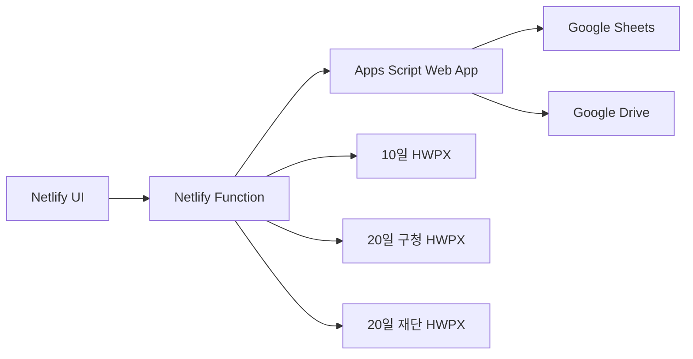

# 문화프로그램 통합수합업무 개발

- 개발 목표: 2026-08-01
- 실제 검증: 2026년 8월 10일·20일 수합
- 노션 원문: [문화프로그램_통합수합업무_개발](https://app.notion.com/p/3a891b75d56c80d98b06f3e46ae9b470)

## PRD

- [10일 수합 PRD](01_PRD_주요업무현황보고_10일.md)
- [20일 수합 PRD](02_PRD_주요업무추진계획_20일.md)

## 기준 기획

- [통합 기획](../01_통합_기획/01_문화프로그램_통합수합업무_자동화.md)
- [10일 상세 기획](../02_상세_기획/01_주요업무현황보고_10일_상세기획.md)
- [20일 상세 기획](../02_상세_기획/02_주요업무추진계획_20일_상세기획.md)

## 공통 모듈

- 인증과 관별 권한
- Google Sheets 운영 저장소
- Apps Script Web App API와 Google Drive 연계
- Netlify Function 인증·세션·HWPX 생성
- 수합 회차·마감
- 관별 제출 상태
- 사업·행사와 일정
- 검증
- 사진 제출용 Google Drive 안내와 파일 이력
- 관리자 검토·수정 요청·포함 여부·정렬
- HWPX 템플릿과 출력 작업
- 감사 로그와 오류 기록

## 개발 순서

1. Google Sheets 탭·키·데이터 계약 확정
2. Apps Script Web App API와 동시쓰기 잠금
3. Netlify Function 인증·세션·API 프록시
4. 제출자 입력·임시저장·제출·재제출
5. 관리자 현황·검토·정렬과 공통 검증
6. 10일 HWPX XML 치환 출력
7. 20일 구청·재단 HWPX XML 치환 출력
8. 과거 HWPX 표본 기반 회귀 테스트
9. 8월 실제 수합 검증과 안정화

## 다음 산출물

- Google Sheets 탭·열·키 명세
- 화면별 와이어프레임
- Apps Script API와 Netlify Function 인터페이스 명세
- HWPX 템플릿 매핑 명세
- 테스트 케이스와 릴리스 체크리스트

상세 구조는 [Google Sheets+Apps Script 아키텍처](03_Google_Sheets_Apps_Script_아키텍처.md)를 기준으로 한다.

## P1 순차 개선 상태

1. 콜드 스타트 완화: 운영 배포·검증 완료
2. 관리자 대시보드와 월·상태 필터: 운영 배포·검증 완료
3. 설정·이용 안내 등 잔여 비활성 기능: 운영 배포·관리자 검증 완료
4. 운영 검토완료 데이터 3종 HWPX 검수: 7월 로컬 기록자료 대체 검수 완료,
   운영 실제자료 검수는 자료 생성 후 별도

### 1단계: 운영 스냅샷 워밍

- 인증된 스냅샷 원문을 브라우저·CDN·별도 영구 저장소에 복제하지 않음
- Netlify 예약 함수가 4분마다 관리자 읽기 전용 `get_snapshot`을 호출하여
  Apps Script의 5분 스크립트 캐시를 유지함
- 예약 호출은 `system-snapshot-warmer` 비식별 행위자 참조를 사용하고
  저장·제출·검토·생성 작업을 호출하지 않음
- 서비스 비밀값은 기존 Netlify 환경변수에서만 읽고 응답·로그에 기록하지 않음
- 12초 상류 타임아웃과 구조화된 성공·실패 로그를 적용함
- 로컬 검증: 테스트 `65개`, 린트, 함수 타입 검사, 프로덕션 빌드 통과
- 운영 예약 실행과 장시간 유휴 후 속도 측정은 최종 일괄 배포 뒤 확인함

### 2단계: 관리자 대시보드와 월·상태 필터

- 관리자 사이드바의 대시보드를 실제 화면과 연결하고 제출 관 수, 검토 진행률,
  프로그램·경고 수, 생성 파일 수를 스냅샷 기준으로 집계함
- 보완요청·작성중 요약을 누르면 해당 상태가 적용된 수합 목록으로 이동함
- 대상 월과 제출 상태를 실제 선택 입력으로 전환하고 수합 유형·월·상태 필터를
  함께 적용함
- 대상 월 변경 시 동일 유형의 해당 월 회차를 선택하며, 결과가 없으면 명확한
  빈 상태를 표시함
- 로컬 브라우저에서 대시보드 집계, 보완요청 이동, 검토완료 필터, 20일 회차
  전환과 콘솔 오류 없음 확인
- 로컬 검증: 테스트 `68개`, 린트, 함수 타입 검사, 프로덕션 빌드 통과
- 운영 화면 확인은 최종 일괄 배포 뒤 진행함

### 3단계: 설정·제출 내역·이용 안내 연결

- 관리자 설정 메뉴를 운영 연결 상태와 계정·문서 정책 확인 화면에 연결함
- 설정 화면은 회차·제출자료·생성 파일 수와 데이터 경로만 표시하고 실제
  비밀번호·서비스 비밀값은 표시하지 않음
- 제출자 제출 내역에서 계정에 연결된 회차별 저장·제출 상태, 관리자 안내와
  마지막 저장 시각을 확인하고 해당 작성 화면으로 돌아갈 수 있게 함
- 제출자 이용 안내에 회차 선택, 임시저장, Drive 사진 별도 제출, 오류 확인,
  제출 내역 확인 절차를 연결함
- 저장·제출·검토 상태처럼 조건에 따라 비활성화되어야 하는 버튼은 기존
  업무 규칙을 유지함
- 로컬 브라우저에서 관리자 설정, 제출 내역의 20일 회차 이동, 이용 안내
  전체 단계와 오류 오버레이 없음 확인
- 로컬 검증: 테스트 `70개`, 린트, 함수 타입 검사, 프로덕션 빌드 통과
- 운영 화면 확인은 최종 일괄 배포 뒤 진행함

### 4단계: 운영 검토완료 데이터 HWPX 검수 사전점검

- 운영 시트는 읽기 전용으로만 확인했으며 셀·상태·Drive 파일을 변경하지 않음
- 확인 범위: `COLLECTIONS!A1:M3`, `SUBMISSIONS!A1:O19`,
  `PROGRAMS!A1:AK1`, `GENERATED_FILES!A1:Q3`
- 10일·20일 제출자료 각 9건, 총 18건이 모두 `draft`이며 검토완료 자료는
  0건임
- `PROGRAMS`는 헤더만 있고 실제 프로그램 행은 0건임
- 기존 10일 생성 이력 2건은 모두 `program_count=0`인 빈 문서이며 20일
  구청·재단 생성 이력은 없음
- 실제 데이터 통합 검수 조건을 충족하지 않아 추가 생성·Drive 보관·다운로드를
  수행하지 않음
- HWPX 전용 원격 도구는 현재 연결되어 있지 않으며, 대상이 준비되면 기존
  로컬 `hwpx` 스킬의 패키지·XSD 검사와 한컴오피스 2020 실열기 검수를 사용함
- 재개 조건: 10일과 20일 회차에 검토완료 프로그램이 존재하고 구청·재단
  포함 여부와 오류·제외 항목이 확정될 것

### 4단계 보완: 7월 로컬 기록자료 대체 검수

- 사용자 지시에 따라 운영 시트 대신 `archive/기록자료/2026-07`의 최종제출
  HWPX 3종과 실제 행사 내용을 로컬 전용 검수 표본으로 사용함
- 원본 3종의 SHA-256을 생성 전후 비교해 모두 불변임을 확인함
- 10일 구청 4건, 20일 구청 5건, 20일 재단 5건을 생성함
- 긴 제목, 복수 날짜·시간, 여러 도서관, 장소, 대상, 인원, 담당자를 포함함
- 실제 7월 항목 중 출력 제외 1건과 담당자 누락 경고 1건을 구성해 세 출력에서
  제외되는지 확인함
- `python-hwpx 4.2.0`의 패키지 검사, 문서 검사, 재열기,
  `editor-open safety`를 세 파일 모두 통과함
- 한컴오피스 2020 실열기 결과: 10일 2쪽, 20일 구청 7쪽, 20일 재단 1쪽;
  표·긴 제목·복수 일정·담당자 줄바꿈과 페이지 안 배치를 확인함
- 세 파일 모두 `hwpx.visual-review.v1`의 `observed_pass`,
  `ready_for_submission_claim=true`와 화면 증거를 기록함
- 산출물·검증 영수증:
  `work/hwpx-july-archive-validation-2026-07-27`
- 재실행 명령: `npm run test:hwpx:july`
- 전체 회귀검사: 테스트 `70개`, 린트, 함수 타입 검사, 프로덕션 빌드 통과

### P1 최종 운영 배포

- Netlify 운영 배포 ID: `6a67580c1fb88d4ee5fc5195`
- 운영 주소: `https://nowonlib-program-collection.netlify.app`
- 배포 상태 `ready`, 신규 JS·CSS와 함수 `auth`, `submissions`, `hwpx`,
  `warm-snapshot` 반영 확인
- `warm-snapshot` 예약 주기 `*/4 * * * *` 등록과 운영 호출 이력 확인
- 읽기 전용 워밍 직접 확인: HTTP `204`, 전체 응답 `2.757초`
- 워밍 이후 관리자 운영 화면 재진입 `2.334초`로 3초 목표 충족
- 운영 관리자 화면에서 대시보드, 실제 9개관 집계, 검토완료 상태 필터의
  빈 결과 안내, 설정 화면과 비밀값 미노출 확인
- 브라우저 콘솔 오류 없음
- 운영 실제 검토완료 자료 3종 HWPX 검수는 자료 생성 후 별도 수행함

### P1 후속: 제출 내역 빈 저장 시각 오류 수정

- 운영 제출자 계정으로 `제출 내역`을 확인하는 과정에서 초기 `draft` 행의
  빈 `savedAt`을 날짜로 변환해 흰 화면이 발생하는 문제를 발견함
- 원인: `Intl.DateTimeFormat`에 유효하지 않은 날짜가 전달되어
  `RangeError: Invalid time value`가 발생함
- 빈 값과 잘못된 날짜는 `-`로 표시하도록 안전 처리를 추가함
- 누락·잘못된·정상 저장 시각 단위 테스트를 추가함
- 전체 회귀검사: 테스트 `72개`, 린트, 함수 타입 검사, 프로덕션 빌드 통과
- 로컬 제출 내역·이용 안내·20일 수합 이동과 콘솔 오류 없음 확인
- Netlify 운영 핫픽스 배포 ID: `6a6760408ab165350dd42bc6`
- 배포 상태 `ready`, 운영 제출 내역의 10일·20일 빈 저장 시각이 모두
  `마지막 저장 -`로 표시되는지 확인
- 운영 이용 안내·20일 수합 이동과 새 브라우저 세션 콘솔 오류 없음 확인

### 운영 시트 7월 기록자료 이관

- 대상: `문화프로그램_통합수합업무_운영DB_v0.1`
- 원본: `archive/기록자료/2026-07` 최종제출 HWPX와 7월 통합 검수 표본
- `COLLECTIONS!A4:M5`: `2026-07-day10`, `2026-07-day20`을
  과거 회차 `archived` 상태로 추가
- `SUBMISSIONS!A20:O37`: 9개관×2회차 18건을 `reviewed` 상태로 추가
- `PROGRAMS!A2:AK14`: 실제 7월 프로그램 13건 추가
  - 10일 6건: 정상 출력 4건, 명시 제외 1건, 담당자 경고 1건
  - 20일 7건: 정상 출력 5건, 명시 제외 1건, 담당자 경고 1건
- `start_date`, `end_date`, `start_time`, `end_time`은 문자열 계약으로
  재확인하고 Google Sheets 자동 시간 숫자 변환을 텍스트로 보정함
- 출력 포함 플래그, 문서별 순서, 검증 상태·메시지, 관리자 메모를 함께 이관함
- 감사 로그:
  `AUDIT_LOG!A4:J4`,
  `bulk-import-2026-07-local-archive-v1`
- Google Sheets 연결 앱의 OAuth 쓰기 범위가 없어 API 배치는 거절됐으나,
  동일 소유자 계정의 Sheets 편집 화면에서 입력하고 API 읽기로 전 범위를 검증함
- 기존 8월 회차·제출자료와 생성 파일 이력은 변경하지 않음
- Apps Script 캐시 만료 후 운영 관리자 화면에서 7월 10일·20일 회차와
  각 회차 9개관 `reviewed` 상태가 정상 노출됨을 확인함
- `오류 항목 제외` 조건의 HWPX 미리보기 결과:
  10일 구청 4건, 20일 구청 5건, 20일 재단 5건
- 파일 생성·Drive 보관은 실행하지 않았으며 운영 화면 콘솔 오류는 없음

### 관리자 대상 월 선택 개선

- 기존 월 선택 드롭다운 앞에 `대상 월` 문구를 표시해 기능을 명확하게 함
- 관리자가 선택한 월을 브라우저에 저장하고 다음 접속·새로고침 시 복원함
- 저장값이 없거나 잘못되었거나 운영 회차에 존재하지 않으면 최신 회차로 안전하게
  대체하고 실제 선택된 월을 다시 저장함
- 브라우저 저장소 접근이 제한되어도 월 선택과 운영 조회는 계속 동작함
- 제출자는 기존 제출 내역에서 과거 회차로 이동하는 흐름을 유지함
- 검증: 전체 테스트 `76개`, 린트, 프로덕션 빌드 통과
- 로컬 관리자 화면에서 `대상 월` 표시, 선택값 유지, 오류 오버레이·콘솔 오류 없음 확인
- Netlify 운영 배포는 다음 일괄 배포 단계에서 수행함

### 관리자 수합 수동 마감·재개

- 관리자 상단에 회차별 `수합 중`·`수합 마감` 상태와 전환 버튼을 추가함
- 마감 전 작성중·수정요청 관 수를 확인창에 표시하고, 재개 시 편집 가능 범위를
  안내함
- 제출자 화면은 닫힌 회차의 입력·행사 추가·임시저장·제출을 모두 잠그고 재개
  방법을 표시함
- 화면 우회 호출도 차단하도록 Apps Script의 저장·제출 단계에서 회차 `open`
  상태를 재검증함
- Netlify Function은 `set_collection_status`를 관리자에게만 허용함
- 데모 모드는 회차별 상태를 브라우저 저장소에 보존해 관리자·제출자 화면을
  함께 검수할 수 있게 함
- 검증: 테스트 `85개`, 린트, Netlify 함수 타입 검사, 프로덕션 빌드 통과
- 로컬 브라우저에서 10일 마감·제출자 잠금, 20일 독립 개방, 10일 재개·편집
  복구와 관리자 6개·제출자 4개 메뉴를 확인함
- 운영 Apps Script·Netlify 배포와 운영 시트 변경은 수행하지 않음

### 관리자 회차 준비·HTML 미리보기·입력 화면 정돈

- 관리자 `새 대상 월 준비`에서 월을 선택하면 10일·20일 회차와 활성 9개관
  제출함을 한 번에 `planned` 상태로 준비함
- 회차 준비와 개방을 분리해 새 월이 자동으로 열리지 않으며, 관리자가 각 회차의
  `수합 열기`로 명시적으로 개방함
- 별도 `출력 작업` 메뉴를 제거하고 일자별 수합 화면의 출력 기능만 유지함
- HWPX 미리보기 모형을 실제 출력 대상 전체를 사용하는 HTML 표로 교체함
- 제출자 입력 화면을 기본 정보·일정·운영 정보·주요 내용 구역으로 정돈하고
  종료일 입력을 명확하게 노출함
- 관리자 직접 수정 화면도 입력 묶음별 카드로 구분함
- 검증: 테스트 `86개`, 린트, Netlify 함수 타입 검사, 프로덕션 빌드 통과
- 로컬 브라우저에서 9월 회차 준비, 수합 예정·열기 표시, 8월 HTML 미리보기
  2건, 관리자 수정 모달과 제출자 입력 구역을 확인함
- 운영 Apps Script·Netlify 배포와 운영 시트 변경은 수행하지 않음

### 관리자 대시보드 출력 문서 확인 영역

- `새 대상 월 준비`를 `수합 열기·마감` 바로 오른쪽으로 옮겨 회차 상태를
  확인한 뒤 새 월을 준비하는 흐름으로 정돈함
- 일자별 수합 화면에서 미리보기·생성·다운로드 영역을 제거함
- 관리자 대시보드에 `10일 구청`·`20일 구청`·`20일 재단` 3종 문서 탭과
  HTML 미리보기·HWPX 생성·다운로드 기능을 통합함
- 7월 실제 HWPX 표본과 생성 로직을 다시 확인해 10일은
  `연번·행사 상세·이미지 영역`, 20일 구청은 문단형 개요, 20일 재단은
  `연번·일시·내용·장소·담당자` 표로 각각 다르게 재현함
- 모든 출력 문서와 HTML 미리보기에서 도서관 약칭을 사용하지 않고
  `월계어린이도서관`과 같은 정식 도서관명을 표시함
- 세 문서 모두 현재 대상 월의 `reviewed` 제출자료만 반영하도록 고정함
- 데모 미리보기도 요청한 회차 ID를 기준으로 10일·20일 자료를 각각 조회함
- 로컬 브라우저에서 3종 모두 검토완료 1개관의 프로그램 2건 표시,
  수합 화면의 문서 기능 미노출, 콘솔 경고·오류 없음을 확인함
- 검증: 테스트 `86개`, 린트, Netlify 함수 타입 검사, 프로덕션 빌드 통과
- 운영 Apps Script·Netlify 배포와 운영 시트 변경은 수행하지 않음

### 제출자 A4 사용 매뉴얼

- 기존 HWP 제출과 웹 수합의 변경점, 로그인, 10일·20일 회차 선택, 입력 항목,
  일정 유형, 사진 Drive 별도 제출, 임시저장·제출, 수정요청·재제출,
  제출 내역과 문제 해결을 14쪽으로 구성함
- 10일·20일 기본 마감 16:00과 관리자 수합 마감의 차이, 수합 중인 경우의
  지연제출 규칙을 별도 안내함
- 현재 화면 기준 필수·선택 입력항목과 좋은 입력·피해야 할 입력 예시를 포함함
- 제출자 운영 정보와 관리자 직접 수정 화면에 `담당자 *` 입력란을 추가하고
  `manager_name` 저장·조회와 20일 구청·재단 HWPX/HTML 미리보기까지 연결함
- 담당자에는 이름만 입력하고 직급·전화번호·이메일을 넣지 않도록 매뉴얼의
  20일 양식 매핑, 항목별 작성 기준, 최종 체크리스트를 갱신함
- 제출자 로컬 화면 7종을 캡처하고 A4 HTML에 삽입함
- 산출물:
  `output/pdf/문화프로그램_통합수합_제출자_사용매뉴얼_A4.html`,
  `output/pdf/문화프로그램_통합수합_제출자_사용매뉴얼_A4.pdf`
- PDF 검수: A4 세로 14쪽, 페이지별 PNG 렌더링, 한글·이미지·표·머리말·
  페이지 번호의 잘림·겹침·빈 페이지 없음 확인
- 담당자 필드 반영 후 테스트 `86개`, 린트, 함수 타입 검사, 프로덕션 빌드 통과
- 매뉴얼 제작 과정에서 변경한 로컬 데모 10일 수합 상태는 기존 마감 상태로
  원상복구함
- 운영 Apps Script·Netlify 배포와 운영 시트 변경은 수행하지 않음

### 운영 시트 호환성 검수 및 통합 배포

- 운영 Spreadsheet 8개 탭과 `schema_version=0.1.0`을 재확인하고
  `PROGRAMS`의 37개 헤더가 현재 코드 계약과 일치함을 확인함
- 새 프로그램의 구조화 일정만 입력해도 Apps Script 필수 필드인
  `schedule_original`을 API 계층과 서버 계층에서 안전하게 생성하도록 보완함
- `manager_name`은 운영 시트 21번째 열과 일치하며 저장·조회·검증 계약을
  변경 없이 사용할 수 있어 별도 시트 마이그레이션은 수행하지 않음
- Apps Script manifest의 웹 앱 실행·익명 접근 설정을 복구해 `doPost`가
  배포 후에도 정상 유지되도록 함
- 운영 Apps Script 웹 앱을 기존 URL 그대로 버전 `9`로 갱신함
- Netlify 운영 배포 `6a6a32e66e1be94fa2fcf8ac` 상태 `ready` 확인
- 자동 검증: 테스트 16개 파일·90개 테스트, 린트, 함수 타입 검사,
  프로덕션 빌드, HWPX 3종 통합 검수 통과
- 운영 관리자 화면에서 7월 20일 수합 9/9 검토완료, 프로그램 7건,
  오류·경고 1건, 생성 파일 3건을 실제 시트 데이터로 확인함
- 10일 구청·20일 구청·20일 재단 HTML 미리보기와 재단 담당자 열을 확인함
- 운영 제출자 `nowon-central` 화면에서 정식 도서관명, 기존 자료,
  `담당자 *` 표시와 보관 회차 편집 잠금을 확인함
- 첫 미리보기 호출은 배포 직후 콜드 스타트 영향으로 한 차례 실패했으나
  재시도 후 3종 모두 정상이며 이후 브라우저 콘솔 경고·오류는 없었음
- 호환성·미리보기 검수는 읽기 전용으로 수행했으며 운영 데이터 추가 저장,
  HWPX 생성·Drive 보관은 실행하지 않음

### 관리자 A4 사용 매뉴얼

- 제출자 매뉴얼과 같은 A4 HTML·PDF 디자인과 설명 밀도로 관리자용 17쪽
  안내서를 제작함
- 로그인과 메뉴, 대상 월·10일·20일 회차 확인, 새 대상 월 준비,
  수합 열기·마감과 16:00 지연제출 기준의 차이를 설명함
- 대시보드 수치, 제출 상태 필터, 관별 프로그램 검토, 출력 포함·순서,
  직접 수정·수정 요청·재제출·검토 완료 상태 흐름을 단계별로 수록함
- 10일 구청·20일 구청·20일 재단 양식 차이, HTML 미리보기,
  오류 항목 제외, HWPX 생성·Drive 보관·재다운로드·한컴 2020 검수 절차를
  포함함
- 설정·작업 기록 확인, 반복 클릭 방지, 오류 캡처·새로고침·재시도·문의
  절차와 월별 최종 체크리스트를 포함함
- 운영 관리자 계정의 실제 비밀번호·서비스 비밀값은 문서에 기록하지 않음
- 관리자 데모 화면 12종과 공통 로그인 화면을 캡처해 삽입함
- 산출물:
  `output/pdf/문화프로그램_통합수합_관리자_사용매뉴얼_A4.html`,
  `output/pdf/문화프로그램_통합수합_관리자_사용매뉴얼_A4.pdf`
- PDF 검수: A4 세로 17쪽, 전 페이지 PNG 렌더링과 접촉면 검수,
  로그인·HWPX 생성 페이지 확대 검수, 잘림·겹침·빈 페이지·한글 깨짐 없음
- 화면 캡처와 매뉴얼 제작 중 운영 시트·회차·제출자료·HWPX 보관 이력은
  변경하지 않음

### 2026-07-31 대상 월·중복 집계·다운로드 안정화 운영 배포

- Google Sheets가 `YYYY-MM` 값을 날짜로 반환하면서 한국시간 월 1일이 UTC
  전날 15시 ISO 문자열로 노출되고, 같은 대상 월 검사가 실패할 수 있는 원인을
  확인함
- Apps Script와 브라우저 API 경계에서 대상 월을 한국시간 `YYYY-MM`으로
  정규화하고 관리자·제출자 화면은 `YYYY년 M월`로만 표시함
- 회차·제출자료·프로그램을 각 ID 기준으로 한 번만 스냅샷에 반영해 기존 중복
  행이 관 수·프로그램 수와 10일·20일 회차 화면에 중복 집계되지 않도록 함
- 새 대상 월 생성 전 기존 시트 날짜값도 정규화해 같은 월의 회차·제출함이 다시
  만들어지지 않도록 차단함
- HWPX Blob URL을 다운로드 시작 직후 폐기하지 않고 60초 유지하며, 데모 생성도
  실제 브라우저 다운로드를 실행하도록 맞춤
- 기존 운영 시트 중복행은 삭제하지 않았으며 운영 스냅샷에서만 제외함
- 로컬 검증: 전체 16개 테스트 파일·93개 테스트, 린트, 함수 타입 검사,
  프로덕션 빌드 통과
- 브라우저 검증: 관리자·제출자 `2026년 8월` 표시, ISO 문자열 미노출,
  10일·20일 각 9개관 분리, 다운로드 폴더 파일 생성, 콘솔 오류 없음 확인
- Apps Script 운영 웹 앱 기존 URL을 버전 `10`으로 갱신함
- Netlify 미리보기와 운영 배포를 순서대로 수행하고 운영 배포
  `6a6c238c7cde2897a9ef269f`을 반영함
- 운영 루트와 고유 배포 URL HTTP 200, JS 자산 일치, 비로그인 API 401,
  Apps Script 공개 상태 응답 정상을 확인함
- 운영 로그인·제출·HWPX 생성과 Drive 보관 등 데이터 변경 검증은 수행하지 않음

### 2026-07-31 제출자 행사 삭제·일정 셀 정규화 운영 배포

- 제출자 단일 행사 편집 화면에 `행사 삭제` 버튼을 추가함
- 임시저장 전 새 행사는 브라우저 상태에서만 삭제하고, 이미 저장된 행사는 기존
  `save_submission` 전체 목록 교체 저장을 즉시 호출해 시트에서도 제거함
- 저장 실패 시 화면의 삭제 상태를 되돌려 브라우저와 시트가 어긋나지 않도록 함
- Sheets 날짜·시간 셀이 ISO 문자열로 직렬화되는 경계에서 `start_date`·
  `end_date`를 `YYYY-MM-DD`, `start_time`·`end_time`을 `HH:mm`으로 정규화함
- 제출완료 자료의 기존 프로그램은 계속 잠그고, 신규 프로그램은 아래의 별도
  추가 제출 경로로만 반영하도록 정정함
- 자동 검증: 전체 16개 테스트 파일·95개 테스트, 린트, 함수 타입 검사,
  프로덕션 빌드 통과
- 브라우저 검증: 삭제 버튼, 새 행사 추가, 정상 일시 표시, 오류 오버레이와
  콘솔 경고·오류 없음 확인
- Apps Script 운영 웹 앱 기존 URL을 버전 `11`로 갱신함
- Netlify 미리보기 배포 `6a6c359a5002b29207605684`, 운영 배포
  `6a6c35ba5f316339fd1a5098`을 반영함
- 운영 루트·고유 배포 URL HTTP 200, 현재 JS·CSS 자산, 비로그인 API 401,
  Apps Script 공개 상태 응답 정상을 확인함
- 운영 로그인 상태의 실제 행사 삭제·시트 반영은 데이터 변경을 피하기 위해
  수행하지 않음

### 2026-07-31 제출완료 후 신규 프로그램 별도 추가 운영 배포

- 버전 `12`의 제출본 재편집 방식은 요구사항 오해로 폐기하고, 제출완료 자료의
  기존 프로그램은 수정·삭제·임시저장할 수 없도록 다시 잠금
- 수합 중인 제출완료·지연제출·재제출완료 자료에는 신규 프로그램
  1건만 작성해 `추가 행사 제출`로 별도 반영할 수 있도록 함
- `append_program` 서버 작업은 기존 프로그램 ID 재사용을 거부하고 새 행만
  추가하므로 클라이언트 요청으로 기존 제출 행을 바꿀 수 없음
- 추가 제출 시 제출자료 버전·프로그램 수·최근 제출시각을 갱신함
- 버전 충돌 검사와 수합 열림 검사를 유지하고, 신규 행사 필수값 검증 후에만
  추가 제출 버튼을 활성화함
- 저장된 행사 삭제 확인 문구를
  `행사를 삭제하면 즉시 반영됩니다. 삭제할까요?`로 변경함
- 자동 검증: 전체 16개 테스트 파일·103개 테스트, 린트, 함수 타입 검사,
  프로덕션 빌드 통과
- 브라우저 검증: 기존 프로그램 입력·삭제 잠금, 신규 1건 편집, 두 번째 신규
  행사 동시 추가 차단, 필수값 완료 후 추가 제출 버튼 활성화, 콘솔 오류 없음
- Apps Script 기존 운영 URL을 버전 `13`으로 갱신함
- Netlify 미리보기 `6a6c3d445a5c5dbffeb3595a`, 운영 배포
  `6a6c3d79536cceb347933fe9`을 반영함
- 운영 루트·고유 배포 HTTP 200, 현재 JS 자산, 비로그인 API 401,
  Apps Script 공개 상태 응답 정상을 확인함
- 운영 제출자료·시트 데이터 변경 검증은 수행하지 않음

### 2026-07-31 검토완료 추가 잠금·관리자 프로그램 삭제 운영 배포

- 검토완료 자료는 신규 행사 추가도 허용하지 않도록 제출자 화면과
  `append_program` 서버 검사를 함께 잠금
- 검토완료 제출자 화면에
  `관리자에 의해 검토가 완료된 자료는 신규 프로그램을 별도 추가할 수 없습니다.
  추가 필요시 담당자에게 문의하세요.` 안내를 표시함
- 관리자 관별 프로그램 목록의 `직접 수정` 옆에 `프로그램 삭제` 버튼을 추가함
- 삭제 확인 후 관리자 전용 `delete_program`이 지정 프로그램 행을 시트에서
  완전히 제거하고 제출자료 프로그램 수·버전·저장시각과 감사 로그를 갱신함
- 제출자 또는 다른 제출자료의 프로그램 ID로 삭제하는 요청은 서버에서 거부함
- 자동 검증: 전체 16개 테스트 파일·105개 테스트, 린트, 함수 타입 검사,
  프로덕션 빌드 통과
- 브라우저 검증: 관리자 삭제 버튼 배치, 검토완료 행사 추가·입력·제출 잠금,
  안내 문구와 콘솔 오류 없음 확인
- Apps Script 기존 운영 URL을 버전 `14`로 갱신함
- Netlify 미리보기 `6a6c4242465477c26c661fe2`, 운영 배포
  `6a6c42684fbfe30d4a64c152`를 반영함
- 운영 루트·고유 배포 HTTP 200, 현재 JS 자산, 비로그인 API 401,
  Apps Script 공개 상태 응답 정상을 확인함
- 운영 로그인 상태의 실제 프로그램 삭제는 데이터 변경을 피하기 위해 수행하지 않음
- 향후 제출자·관리자 A4 매뉴얼 개정 시 검토완료 후 추가 제출 불가 정책과
  관리자 프로그램 영구 삭제 절차·주의 문구를 반영할 것
- 검토완료 추가 제출 차단 안내를
  `관리자에 의해 검토가 완료된 자료는 신규 프로그램을 별도 추가할 수 없습니다.
  추가 필요시 담당자에게 문의하세요.`로 통일하고 Apps Script 버전 `15`,
  Netlify 운영 배포 `6a6c445afa8c78da116e52c7`에 반영함

### 2026-07-31 사진 업로드 Drive 링크 운영 배포

- 제출자 화면의 기존 사진 별도 제출 안내에 공용 Google Drive 폴더 링크를 연결함
- 웹에서 사진을 직접 수집하지 않고, 링크로 폴더를 연 뒤 폴더 안의 파일명 규칙을
  확인해 업로드하도록 안내함
- 자동 검증: 전체 16개 테스트 파일·105개 테스트, 린트, 함수 타입 검사,
  프로덕션 빌드 통과
- Netlify 미리보기 `6a6c492e75228016cc011506`, 운영 배포
  `6a6c4953de4ab9086d8d2973`을 반영함

### 2026-07-31 마감 전 제출완료 자유 수정 운영 배포

- 수합 중이며 마감 전인 제출완료·재제출완료 자료는 관리자 수정 요청 없이
  기존 행사 수정·삭제와 신규 행사 추가를 포함한 전체 수정 저장을 허용함
- 제출완료 수정은 별도 재제출 없이 `수정 내용 저장` 즉시 관리자 화면에 반영하고
  제출 상태와 최초 제출 시각은 유지함
- 마감 후에는 관리자 수정 요청이 있어야 편집할 수 있으며 검토완료 자료는
  마감 전이어도 즉시 잠금
- 서버 시간을 기준으로 마감 여부를 재검증하고 제출완료 수정 저장에는 최종 제출과
  같은 필수값·일정 검증을 적용함
- 관리자와 제출자의 동시 작업은 기존 `expected_version` 충돌 검사로 보호함
- 자동 검증: 전체 16개 테스트 파일·109개 테스트, 린트, 함수 타입 검사,
  프로덕션 빌드 통과
- 브라우저 검증: 제출완료 자료의 기존 행사 편집·삭제·추가와
  `수정 내용 저장`, 검토완료 자료의 입력·저장 잠금, 콘솔 오류 없음 확인
- Apps Script 기존 운영 URL을 버전 `16`으로 갱신함
- Netlify 미리보기 `6a6c57536689c400c28e73d7`, 운영 배포
  `6a6c576e93e07000d517dd28`을 반영함
- 운영 루트 HTTP 200, 현재 JS 자산의 정책 안내, 비로그인 API 401,
  Apps Script 공개 상태 응답 정상을 확인함
- 다음 제출자·관리자 A4 매뉴얼 개정 시 마감 전 자유 수정과 마감 후
  관리자 수정 요청 정책을 반영할 것

### 2026-07-31 제출자 마지막 프로그램 삭제 오류 수정

- 원인: 제출완료 수정 저장의 1건 이상 검증이 마지막 프로그램 삭제에도 적용되어
  시트의 0건 저장을 거부함
- 수정: 마지막 프로그램 삭제는 0건으로 즉시 저장하고, 프로그램이 남아 있으면
  기존 필수값·일정 검증을 그대로 적용함
- 회귀검증: 전체 16개 테스트 파일·110개 테스트, 린트, 함수 타입 검사,
  프로덕션 빌드 통과
- Apps Script 기존 운영 URL을 버전 `17`로 갱신하고 공개 상태 응답 정상을 확인함
- 운영 자료를 직접 삭제하는 검증은 데이터 보존을 위해 수행하지 않음

### 2026-08-08 수합 1회·문서 3종 통합

- 제출자가 월별 문화프로그램 자료를 한 번만 작성·제출하도록 수합 화면을 1개로 통합함
- 입력 기준은 `수합업부작성방법.hwpx`의 제목 말머리, 개요, 일시, 장소, 대상·인원,
  담당자 이름 항목을 따름
- 같은 검토완료 자료에서 구청 현황보고·구청 추진계획·재단 월간일정표 HWPX 3종을
  버튼 1회로 생성·보관·다운로드하도록 변경함
- 기존 10일·20일 보관 회차는 조회 호환성을 유지함
- 통합 수합 마감은 매월 10일 16:00으로 확정함
- Notion 연결 중지 요청에 따라 로컬 코드와 문서에만 반영함

### 2026-08-01 제출자·관리자 A4 매뉴얼 v1.1 개정

- 기존 A4 편집 체계를 유지해 제출자 14쪽, 관리자 17쪽 HTML/PDF를 개정함
- 제출자 매뉴얼에 마감 전 제출완료 자유 수정·신규 행사 추가·저장 행사 즉시 삭제,
  마감 후 관리자 수정요청, 검토완료 즉시 잠금 정책을 반영함
- 공용 Google Drive의 `사진 업로드 폴더 열기` 버튼과 파일명 규칙 확인 절차를 반영함
- 관리자 매뉴얼에 마감 전 제출자 자체 수정 모니터링, 마감 후 수정요청,
  검토완료 즉시 잠금, `직접 수정` 옆 `프로그램 삭제`의 시트 영구 삭제 주의를 반영함
- 관리자 프로그램 영구 삭제와 문서 출력 제외 체크박스의 차이를 명시함
- 최신 로컬 데모 화면을 다시 캡처하고 브라우저 콘솔 오류가 없음을 확인함
- PDF 렌더링 후 전 페이지 이미지 검사, A4 크기, 빈 페이지, 필수 문구,
  초 단위 ISO 일시 표기 잔존 여부를 확인함
