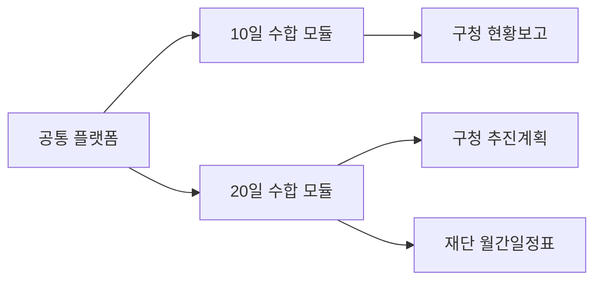

# 문화프로그램 통합수합업무 개발

- 개발 목표: 2026-08-01
- 실제 검증: 2026년 8월 10일·20일 수합
- 노션 원문: [문화프로그램_통합수합업무_개발](https://app.notion.com/p/3a891b75d56c80d98b06f3e46ae9b470)

## PRD

- [10일 수합 PRD](01_PRD_주요업무현황보고_10일.md)
- [20일 수합 PRD](02_PRD_주요업무추진계획_20일.md)

## 기준 기획

- [통합 기획](../01_통합_기획/01_문화프로그램_통합수합업무_자동화.md)
- [10일 상세 기획](../02_상세_기획/01_주요업무현황보고_10일_상세기획.md)
- [20일 상세 기획](../02_상세_기획/02_주요업무추진계획_20일_상세기획.md)

## 공통 모듈

- 인증과 관별 권한
- 수합 회차·마감
- 관별 제출 상태
- 사업·행사와 일정
- 검증
- 첨부파일
- 관리자 검토·수정 요청·포함 여부·정렬
- HWPX 템플릿과 출력 작업
- 감사 로그와 오류 기록

## 개발 순서

1. 공통 데이터 모델, 회차, 권한
2. 제출자 입력·임시저장·제출·재제출
3. 관리자 현황·검토·정렬
4. 공통 검증
5. 10일 HWPX 출력
6. 20일 구청·재단 출력
7. 과거 HWP 표본 기반 회귀 테스트
8. 8월 실제 수합 검증과 안정화

## 다음 산출물

- 공통 데이터베이스 스키마와 ERD
- 화면별 와이어프레임
- API 또는 백엔드 인터페이스 명세
- HWPX 템플릿 매핑 명세
- 테스트 케이스와 릴리스 체크리스트
